<!--
author:   Andre Dietrich
language: de
narrator: Deutsch Female

edit:     true
date:     2026-09-07

comment:  Handwerkskammer Dresden

tags:     Belehrung;
          Brandschutz;
          Hausordnung;
          Dresden

-->

# Haus- und Brandschutzordung

Handwerkskammer Dresden
------------------------

> Hallo liebe Kursteilnehmer, in Vorbereitung unserer gemeinsamen Arbeit werden wir nun zunächst die Ordnungen der Handwerkskammer Dresden gemeinsam durcharbeiten und dabei auf die für diese Veranstaltung zentralen Vorgaben eingehen. Dafür habe ich zwei Abschnitte vorgesehen, die wir nun Schritt für Schritt thematisieren. Diese umfasst die Belehrung aber auch allgemeine Hinweise zum Gelände der Handwerkskammer.

Haus- und Werkstattordnung bezeichnet eine Sammlung von Regeln und Vorschriften, die für das Verhalten und die Nutzung von Räumlichkeiten in einem Gebäude oder einer Werkstatt gelten. Sie legt fest, welche Sicherheitsmaßnahmen einzuhalten sind, welche Verantwortlichkeiten bestehen und welche Verhaltensweisen erwartet werden, um einen geordneten und sicheren Betrieb zu gewährleisten.

__Klicken Sie unten auf den Pfeilen, um im Dokument zu navigieren.__

## I. Allgemeine Hausordnung

    --{{0}}--
Verletzungen sind von den Ersthelfern zu versorgen und in das Erste-Hilfe-Buch einzutragen.

     {{0-1}}
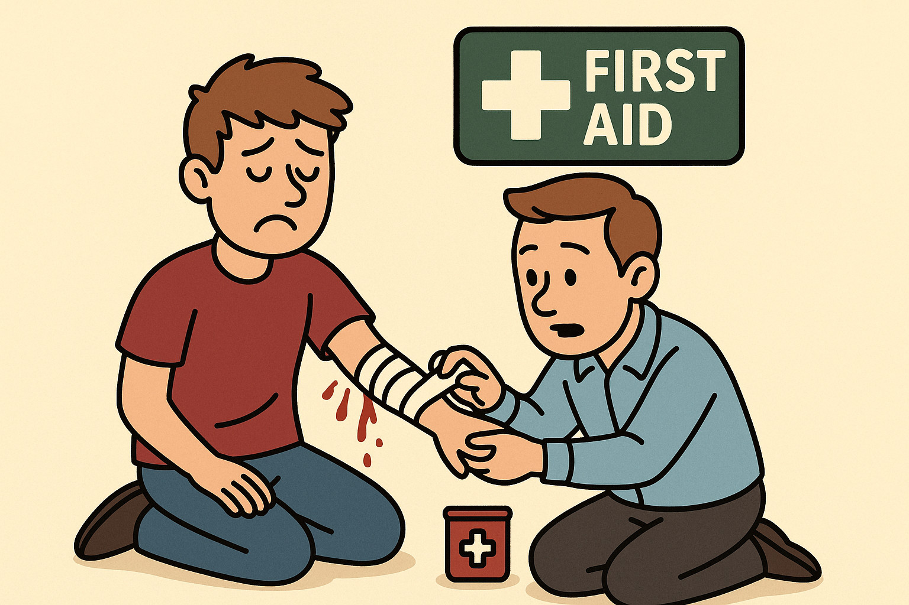

    --{{1}}--
Der Empfänger von Bombendrohungen hat sofort seinen Vorgesetzten über die Art und den Inhalt der Drohung zu informieren.

     {{1-2}}
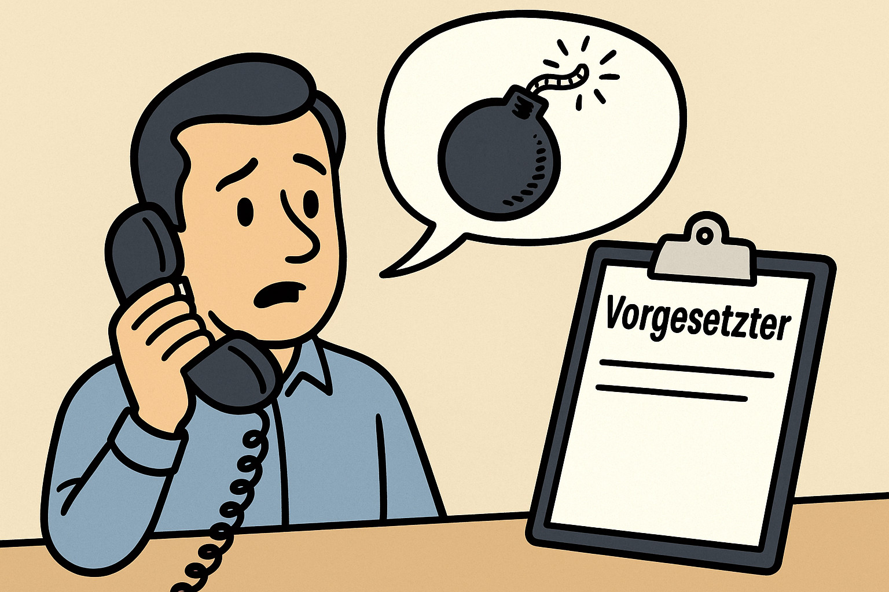

    --{{2}}--
Im Falle eines Amoklaufs ist sofort die Polizei (110) und der Empfang der Handwerkskammer (intern 30/31 oder extern 0351 4640-30) zu informieren.

     {{2-3}}
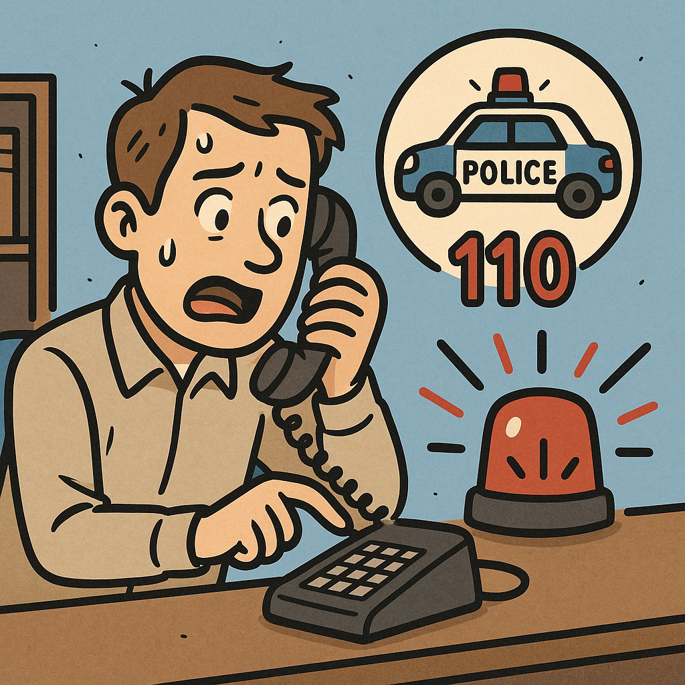

    --{{3}}--
Das Tragen und Nutzen von Zeichen und Materialien (Bekleidung, Bild- und Tonträger, Bücher, Grußformen, Parolen, Propagandamittel und Formulierungen der Volksverhetzung u. a.), die darauf schließen lassen, dass ein Kontakt zu extremistischem Gedankengut bzw. Gruppierungen besteht, ist verboten.

     {{3-4}}
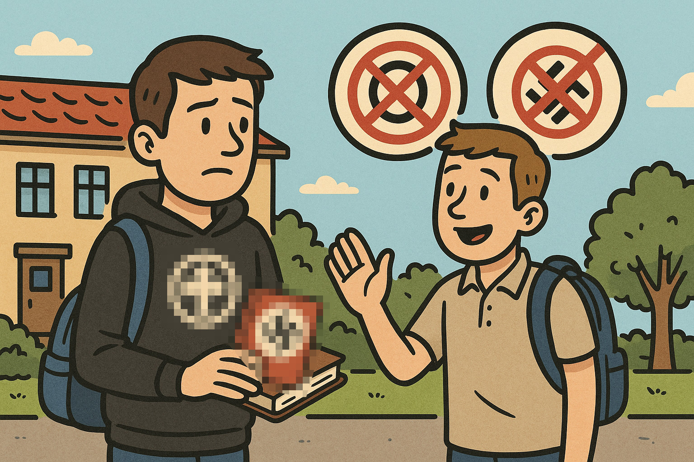

    --{{4}}--
Das Rauchen ist, mit Ausnahme in den festgelegten Raucherzonen, im gesamten Objekt verboten.

     {{4-5}}
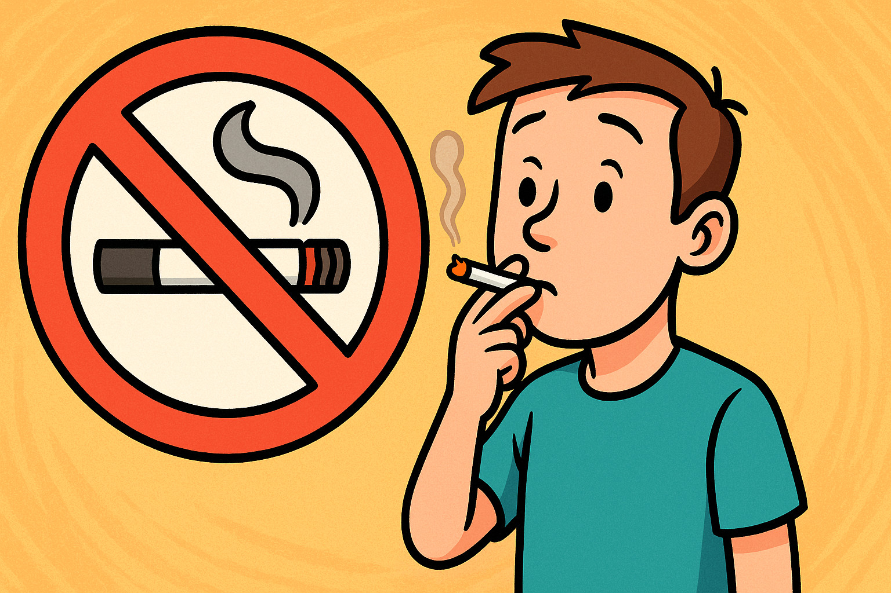

    --{{5}}--
Der Konsum von alkoholischen Getränken und sonstiger Rauschmittel ist grundsätzlich verboten.
Dieses Verbot schließt den Vertrieb oder die Weitergabe sonstiger Rauschmittel ein.
Verstöße gegen das Betäubungsmittelgesetz werden zur Anzeige gebracht.

     {{5-6}}
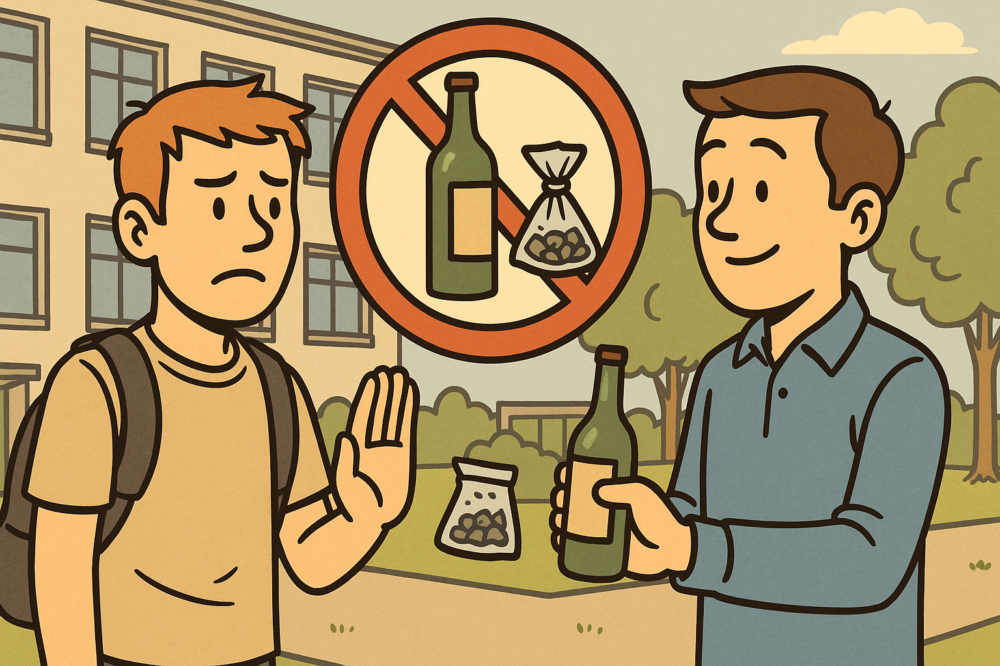

    --{{6}}--
Waffen jeglicher Art, auch Schreckschuss- oder Luftdruckwaffen, sind im Objekt verboten.

     {{6-7}}
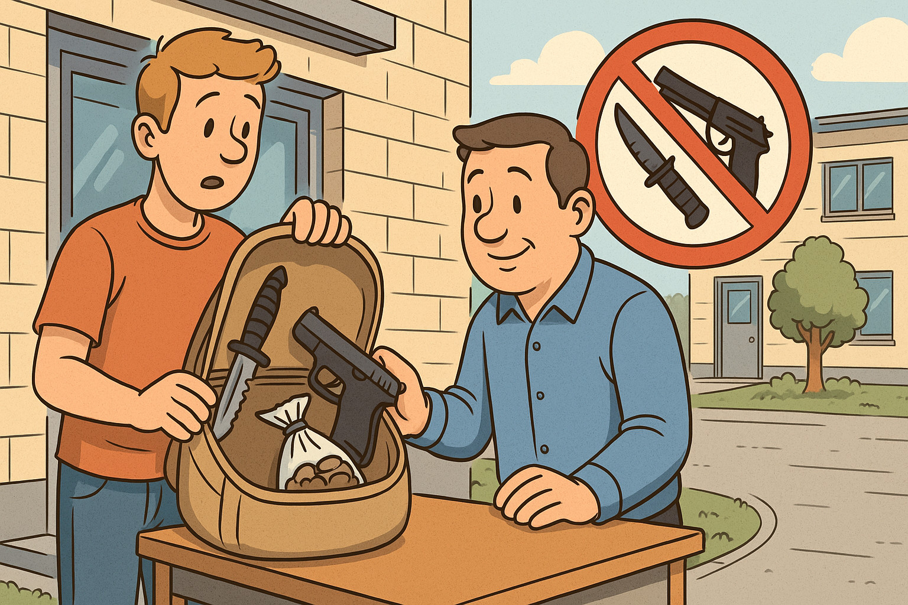

    --{{7}}--
In der Zeit von 22:00 Uhr bis 05:00 Uhr sind die Einfahrtstore verschlossen. In dieser Zeit ist das Befahren des Geländes mit Kraftfahrzeugen grundsätzlich nicht gestattet.

     {{7-8}}
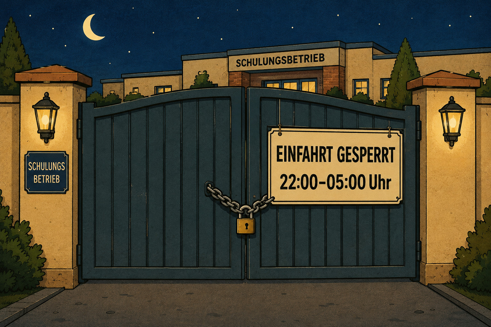

    --{{8}}--
Die Handwerkskammer Dresden haftet nicht für abhanden gekommene Sachen und Gegenstände (Bekleidung, Wertsachen etc.).

     {{8-9}}
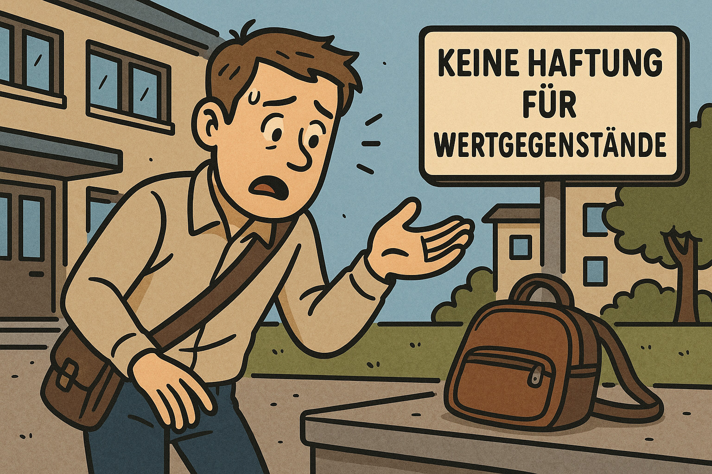

    --{{9}}--
Während des Unterrichts und bei Prüfungen sind Handys grundsätzlich auszuschalten.

     {{9-10}}
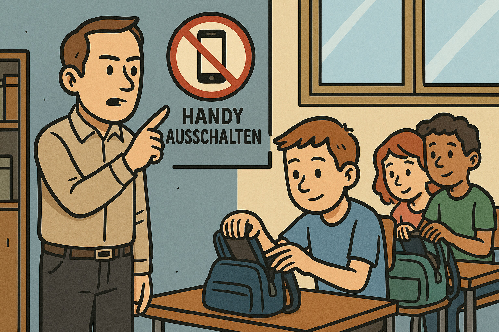

    --{{10}}--
Verhalten im Brandfall und bei gefahrdrohenden Situationen:

    --{{11}}--
Verlassen Sie das Gebäude auf dem kürzesten, nächstliegenden Fluchtweg, entsprechend Flucht- und Rettungsplan, benutzen Sie keinen Aufzug. Unterstützen Sie Behinderte.

     {{11-12}}
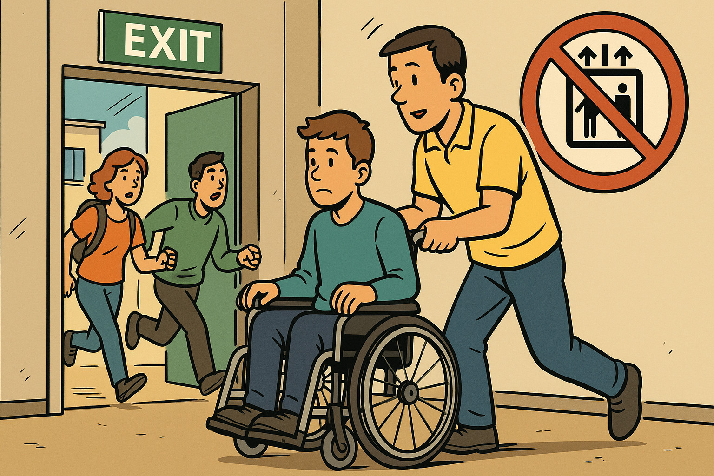

    --{{12}}--
Sammeln Sie sich sofort an den ausgewiesenen Sammelstellen.

     {{12-13}}
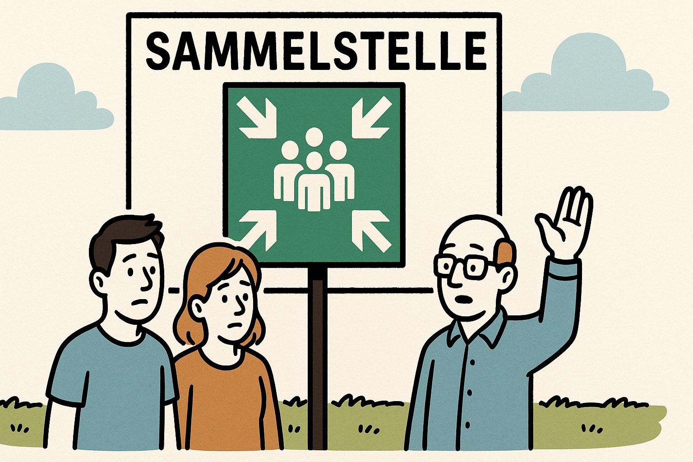

    --{{13}}--
In Brand geratene elektrische Anlagen oder Geräte sind vom Netz zu trennen.

     {{13}}
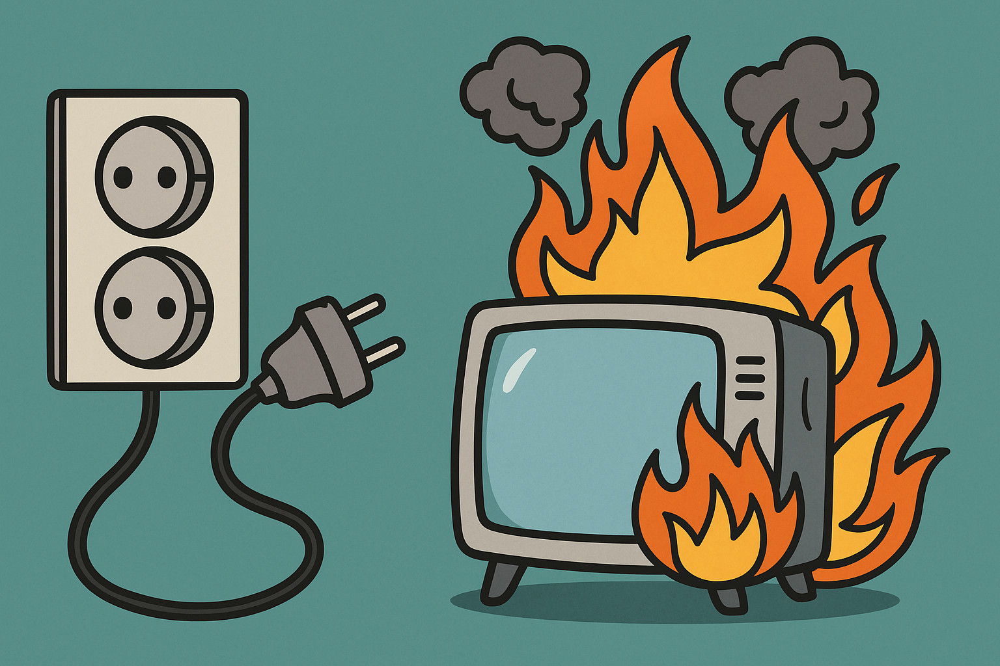

### Wissenstest

    {{0-1}}
<section>

__Was ist im Brandfall zu tun?__

<!-- --{{0}}--
Was ist im Brandfall zu tun? -->

- [[x]] Gebäude auf kürzestem Fluchtweg verlassen, keinen Aufzug benutzen
- [[ ]] Zunächst persönliche Sachen aus dem Raum holen
- [[ ]] Auf den Aufzug warten
- [[x]] Behinderten Menschen helfen

</section>

    {{1-2}}
<section>

__Ordnen Sie die Situationen den richtigen Verhaltensweisen zu.__

<!-- --{{1}}--
Ordnen Sie die Situationen den richtigen Verhaltensweisen zu. -->

<!--
data-randomize="true" 
data-show-partial-solution="true"
data-solution-button="false"
-->
| Situation     | Verhaltensweise                                                          |
| ------------- | ------------------------------------------------------------------------ |
| Sammelstelle  | [->[(Sofort nach Evakuierung aufsuchen)]]                                |
| Erste Hilfe   | [->[(Verletzungen versorgen und ins Erste-Hilfe-Buch eintragen)]]        |
| Bombendrohung | [->[(Sofort Vorgesetzten informieren)]]                                  |
| Amoklauf      | [->[(Polizei (110) und Empfang der Handwerkskammer benachrichtigen)]]    |

</section>

    {{2}}
<section>

__Welche Aussagen zur Hausordnung sind korrekt?__

<!-- --{{2}}--
Welche Aussagen zur Hausordnung sind korrekt? -->

<!--
data-randomize="true" 
data-show-partial-solution="true"
data-solution-button="false"
-->
- [[x]] Rauchen ist nur in ausgewiesenen Zonen erlaubt.
- [[ ]] Alkoholische Getränke dürfen in Pausen konsumiert werden.
- [[x]] Waffen jeglicher Art sind verboten.
- [[ ]] Handys dürfen während Prüfungen eingeschaltet bleiben.
- [[x]] Extremistische Symbole und Materialien sind verboten.
- [[ ]] Nachts dürfen Fahrzeuge jederzeit auf das Gelände fahren.

</section>

## II. Werkstatt- und Laborordnung

    --{{0}}--
Den Weisungen der Lehrer/Ausbilder ist unbedingt Folge zu leisten.

     {{0-1}}
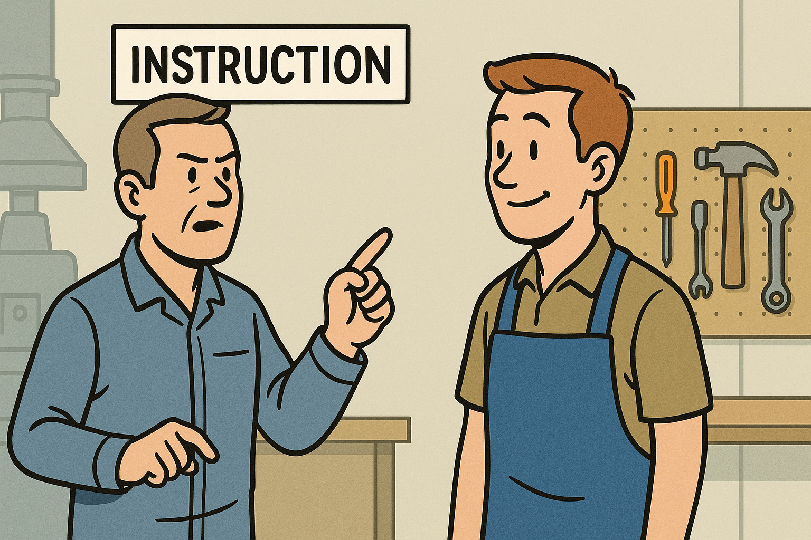

    --{{1}}--
Die Werkstätten dürfen nur mit Arbeitsschutzbekleidung sowie Arbeitsschutzschuhen betreten werden.

     {{1-2}}
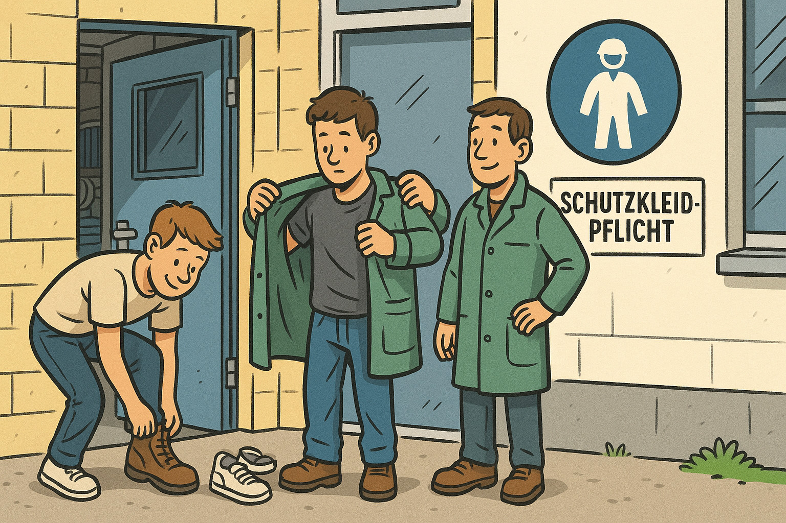

    --{{2}}--
Die jeweils geltenden aushängenden Betriebsanweisungen sind zu beachten.

     {{2-3}}
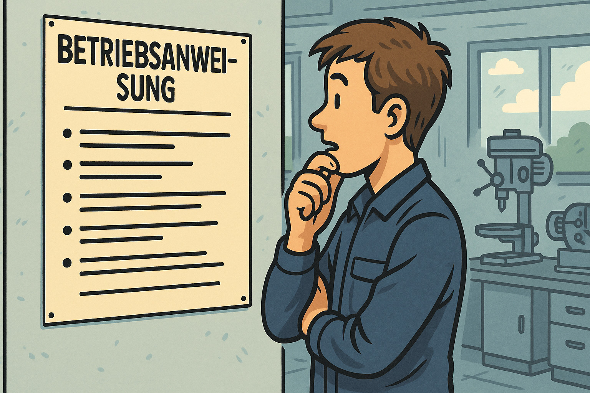

    --{{3}}--
Keine Arbeit an unter Spannung stehenden Teilen!

     {{3-4}}
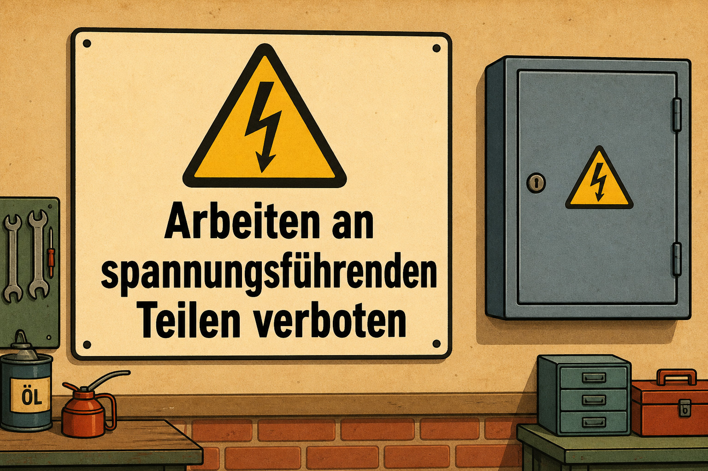

    --{{4}}--
Die Bedienung der Unterrichtstechnik obliegt ausschließlich dem Dozenten.

     {{4-5}}
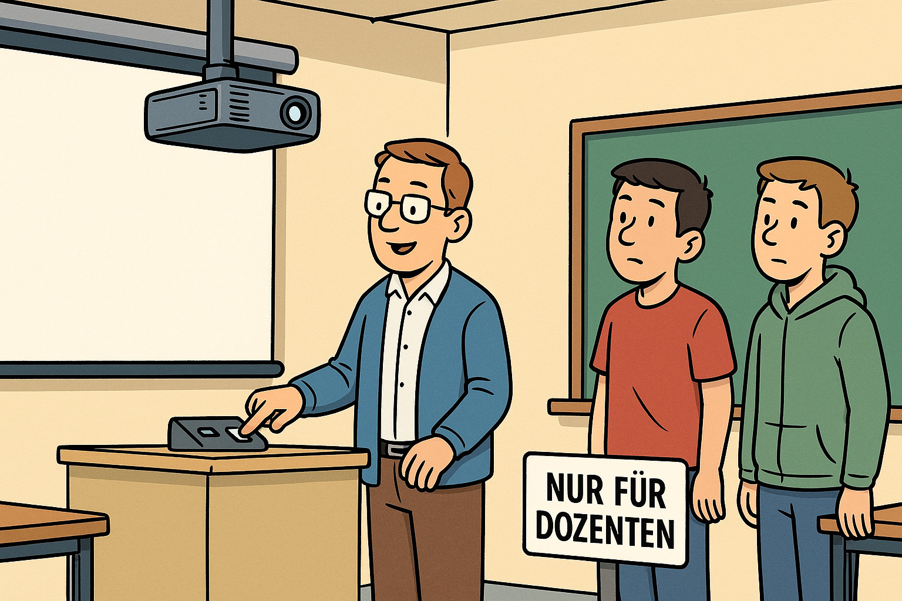

    --{{5}}--
Gewaltanwendungen jeglicher Art sind verboten.
Teilnehmer haften für mutwillig beschädigte oder entwendete Werkstatt- bzw. Laboreinrichtungen und Gegenstände in Höhe des Wiederbeschaffungswertes.

     {{5-6}}
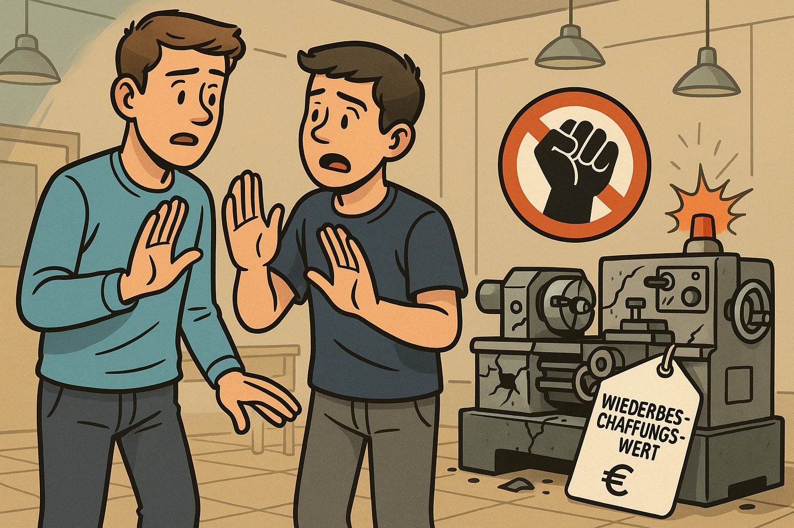

    --{{6}}--
Die Aufstellung der Tische und Stühle in den Seminarräumen ist beizubehalten.

     {{6-7}}
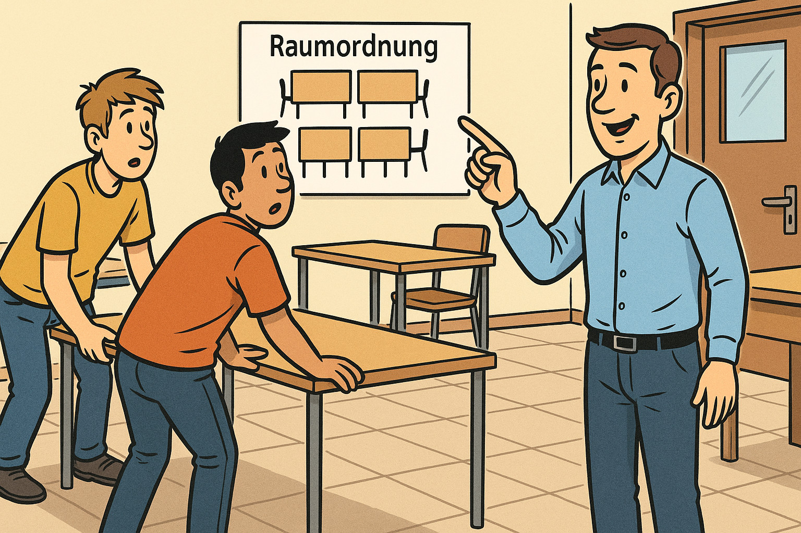

    --{{7}}--
Der Aufenthalt in Werkstätten und Labors sowie im Computerkabinett sowie das Arbeiten am Computer sind nur in Anwesenheit und nach Aufforderung des Dozenten gestattet.

     {{7-8}}
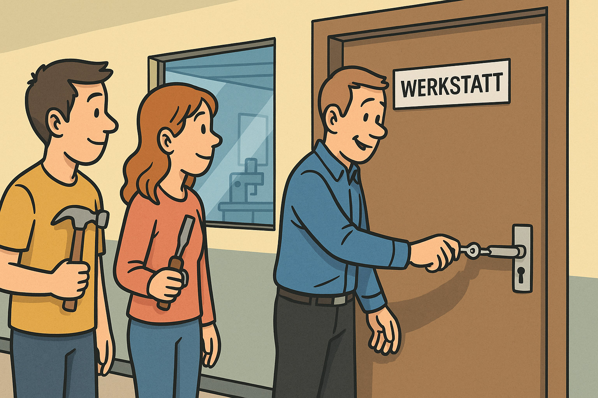

    --{{8}}--
Es ist unzulässig, selbständig Software auf dem Computer zu installieren oder Kopien installierter Software zu erstellen.
Des Weiteren ist das Herunterladen von Daten jeglicher Art aus sowie das Surfen auf pornographischen, gewaltverherrlichenden oder extremistischen Seiten im World Wide Web verboten.

     {{8-9}}
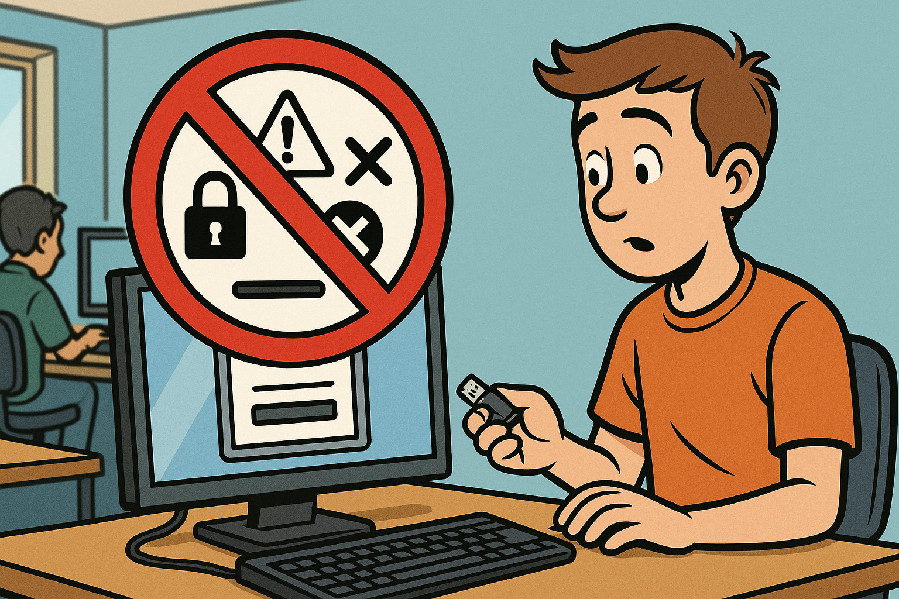

    --{{9}}--
Im Computerkabinett und in Labors ist der Verzehr von Speisen und Getränken nicht gestattet.

     {{9}}
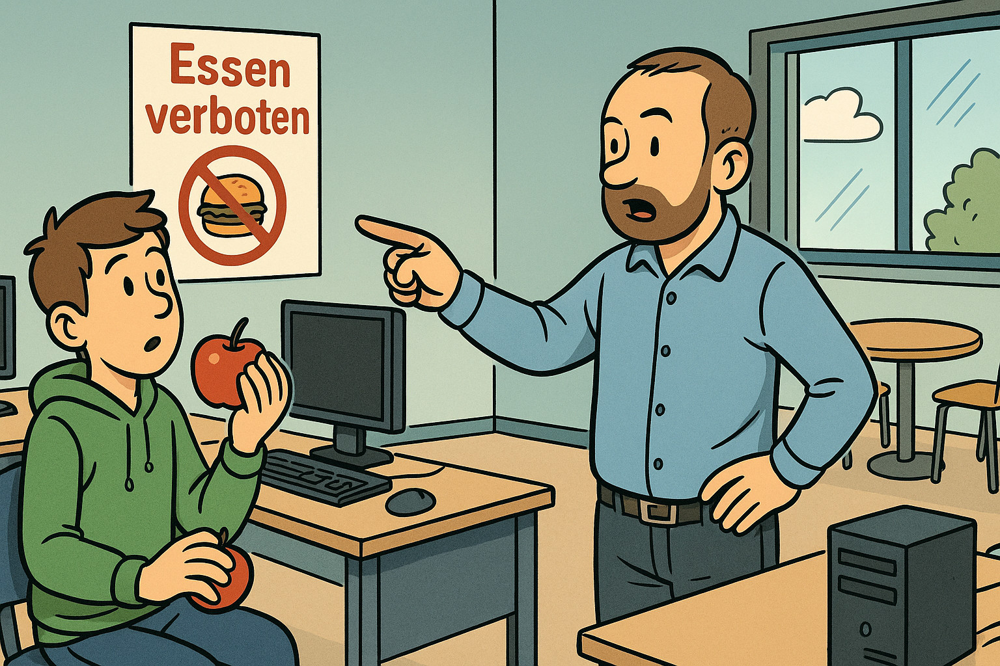

### Wissenstest

    {{0-1}}
<section>

__Welche Regeln gelten in Werkstätten und Laboren?__

<!-- --{{0}}--
Welche Regeln gelten in Werkstätten und Laboren? -->

<!--
data-randomize="true" 
data-show-partial-solution="true"
data-solution-button="false"
-->
- [[x]] Essen und Trinken sind im Computerkabinett und in Labors verboten.
- [[ ]] Software darf eigenständig installiert werden.
- [[x]] Die Werkstätten dürfen nur mit Arbeitsschutzbekleidung betreten werden.
- [[ ]] Man darf auch ohne Dozent im Computerkabinett arbeiten.

</section>

    {{1-2}}
<section>

-----------------------------

__Ordnen Sie die Vorschriften den richtigen Bereichen zu.__

<!-- --{{1}}--
Ordnen Sie die Vorschriften den richtigen Bereichen zu. -->

<!--
data-randomize="true" 
data-show-partial-solution="true"
data-solution-button="false"
-->
Arbeitsschutzkleidung -> [->[(Pflicht beim Betreten der Werkstätten)]]\
Dozent                -> [->[(Bedienung der Unterrichtstechnik)]]\
Teilnehmer            -> [->[(Haften für mutwillige Beschädigungen)]]\
Lehrer/Ausbilder      -> [->[(Deren Weisungen ist unbedingt Folge zu leisten)]]

</section>

    {{2}}
<section>

-----------------------------

__Welche Aussagen sind richtig oder falsch?__

<!-- --{{2}}--
Welche Aussagen sind richtig oder falsch? -->

<!--
data-randomize="true" 
data-show-partial-solution="true"
data-solution-button="false"
-->
- [[x]] An unter Spannung stehenden Teilen darf nicht gearbeitet werden.
- [[ ]] Das Surfen auf beliebigen Internetseiten ist erlaubt.
- [[x]] Gewaltanwendungen jeglicher Art sind verboten.
- [[ ]] Die Aufstellung der Tische und Stühle darf beliebig verändert werden.

</section>
