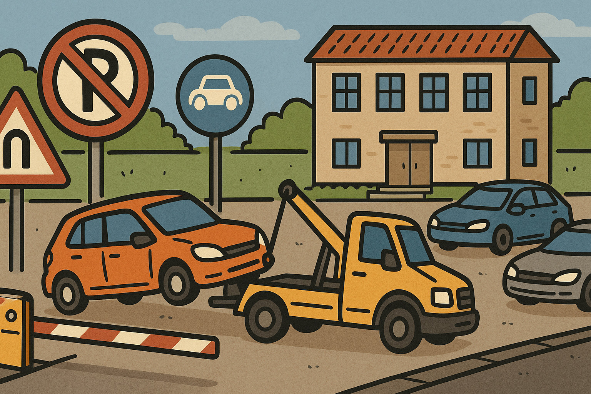
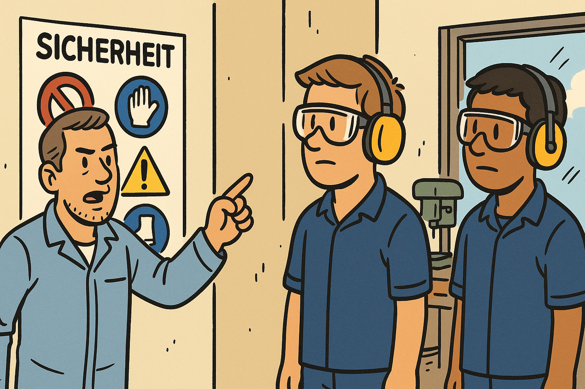
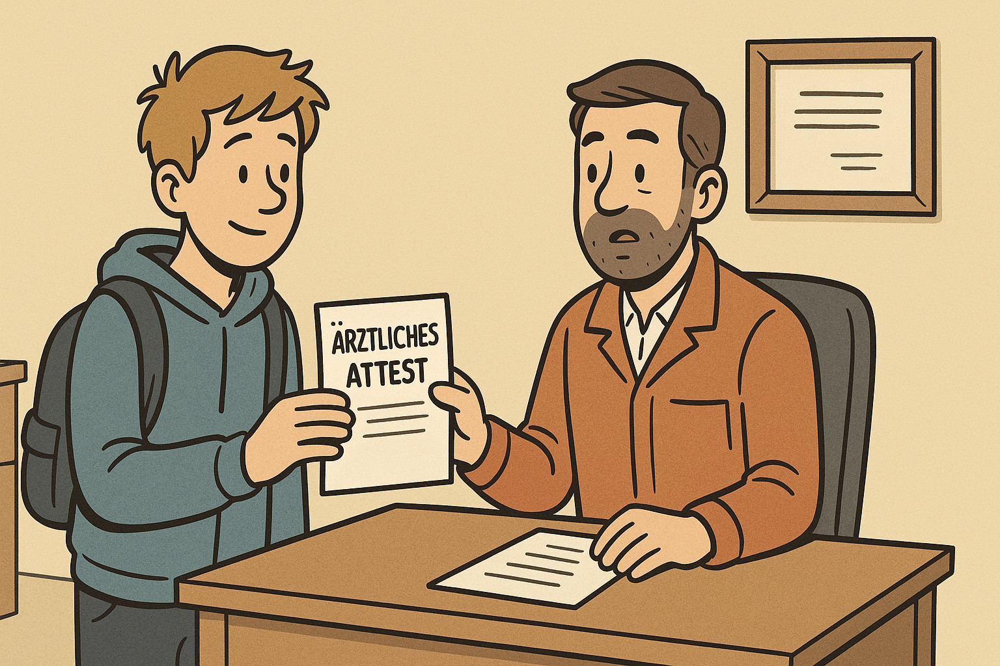
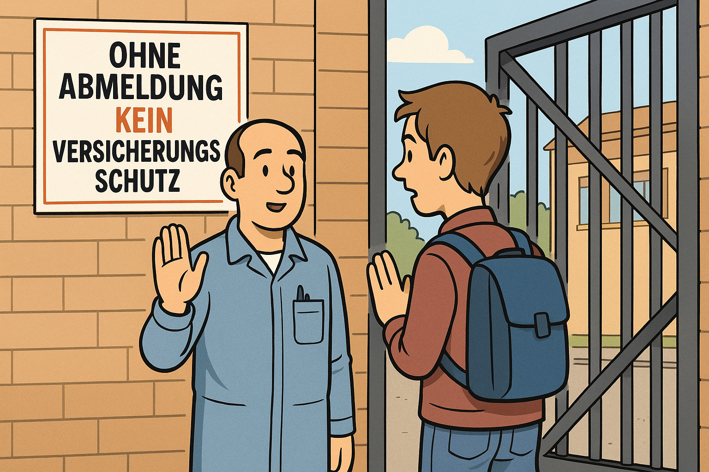

<!--
author:   Andre Dietrich
language: de
narrator: Deutsch Female

version:  1.0.0
edit:     true
date:     2025-08-20

icon:     https://ifi-diagnostik-project.github.io/assets/img/Logo_234px.png

logo:     assets/image/haus-und-brandschutzordnung-pirna.png

comment:  Der Kurs vermittelt die Haus- und Werkstattordnung des BTZ Pirna, ebenfalls gegliedert in allgemeine Hausordnung und Werkstatt-/Laborordnung. Schwerpunkte sind das Verhalten im Brandfall sowie weitere gefahrdrohende Situationen und die Regeln zur sicheren Nutzung der Räumlichkeiten und Werkstätten. Wie beim Dresden-Kurs sichern eingebettete Wissenstests das Behalten der Inhalte.

tags:     Belehrung,
          Brandschutz,
          Hausordnung,
          Pirna

-->

# Haus- und Brandschutzordung (Pirna)

Berufsbildungs- und Technologiezentrum Pirna
--------------------------------------------

> Hallo liebe Kursteilnehmer, in Vorbereitung unserer gemeinsamen Arbeit werden wir nun zunächst die Ordnungen der Handwerkskammer Dresden gemeinsam durcharbeiten und dabei auf die für diese Veranstaltung zentralen Vorgaben eingehen. Dafür habe ich zwei Abschnitte vorgesehen, die wir nun Schritt für Schritt thematisieren. Diese umfasst die Belehrung aber auch allgemeine Hinweise zum Gelände des Ausbildungszentrums. 

Haus- und Werkstattordnung bezeichnet eine Sammlung von Regeln und Vorschriften, die für das Verhalten und die Nutzung von Räumlichkeiten in einem Gebäude oder einer Werkstatt gelten. Sie legt fest, welche Sicherheitsmaßnahmen einzuhalten sind, welche Verantwortlichkeiten bestehen und welche Verhaltensweisen erwartet werden, um einen geordneten und sicheren Betrieb zu gewährleisten.

__Klicken Sie unten auf den Pfeilen, um im Dokument zu navigieren.__

## I. Allgemeine Hausordnung

    --{{0}}--
!?[▶️](assets/video/verhalten-im-brandfall.mp4)
Verhalten im Brandfall und bei gefahrdrohenden Situationen:

    --{{1}}--
!?[▶️](assets/video/fluchtweg.mp4)
Verlassen Sie das Gebäude auf dem kürzesten Fluchtweg, entsprechend Flucht- und Rettungsplan, benutzen Sie keinen Aufzug, unterstützen Sie Behinderte.

     {{1-2}}

    --{{2}}--
!?[▶️](assets/video/sammelstellen.mp4)
Sammeln Sie sich sofort an ausgewiesenen Sammelstellen.

     {{2-3}}

    --{{3}}--
!?[▶️](assets/video/elektrobrand.mp4)
In Brand geratenen elektrischen Anlagen oder Geräte sind vom Netz zu trennen.

     {{3-4}}

    --{{4}}--
!?[▶️](assets/video/ersthelfer.mp4)
Verletzungen sind von den Ersthelfern zu versorgen und in das Erste-Hilfe-Buch einzutragen.

     {{4-5}}

    --{{5}}--
!?[▶️](assets/video/bombendrohung.mp4)
Der Empfänger von Bombendrohungen hat sofort seinen Vorgesetzten über die Art und den Inhalt der Drohung zu informieren.

     {{5-6}}

    --{{6}}--
!?[▶️](assets/video/amoklauf-pirna.mp4)
Im Falle eines Amoklaufs ist die Polizei (110) und die Verwaltung des BTZ Pirna (intern 471 oder extern 3501 4618870) zu informieren.

     {{6-7}}

    --{{7}}--
!?[▶️](assets/video/extremismus.mp4)
Das Tragen und Nutzen von Zeichen und Materialien (Bekleidung, Bild- und Tonträgern, Bücher, Grußformen, Parolen, Propagandamittel und Formulierungen der Volksverhetzung u.a.), die darauf schließen lassen, dass ein Kontakt zu extremistischem Gedankengut bzw. Gruppierungen besteht, ist verboten.

     {{7-8}}

    --{{8}}--
!?[▶️](assets/video/rauchverbot.mp4)
Das Rauchen ist, mit Ausnahme in den festgelegten Raucherzonen, im gesamten Objekt verboten.

     {{8-9}}

    --{{9}}--
!?[▶️](assets/video/drogenverbot.mp4)
Der Konsum von alkoholischen Getränken und sonstiger Rauschmittel ist grundsätzlich verboten.
Dieses Verbot schließt den Vertrieb oder die Weitergabe sonstiger Rauschmittel ein.
Verstöße gegen das Betäubungsmittelgesetz werden zur Anzeige gebracht.

     {{9-10}}

    --{{10}}--
!?[▶️](assets/video/waffenverbot.mp4)
Waffen jeglicher Art, auch Schreckschuss- oder Luftdruckwaffen, sind im Objekt verboten.

     {{10-11}}

    --{{11}}--
!?[▶️](assets/video/stvo.mp4)
Im Gelände gilt die STVO, das Abstellen von Fahrzeugen geschieht auf eigene Gefahr.
Widerrechtlich abgestellte Fahrzeuge werden kostenpflichtig abgeschleppt.
Außerhalb der Lehrgangszeiten sind die Einfahrtstore geschlossen.
In dieser Zeit sind das Befahren des Geländes mit Kraftfahrzeugen sowie das Parken grundsätzlich nicht gestattet.

     {{11-12}}

    --{{12}}--
!?[▶️](assets/video/haftung.mp4)
Die Handwerkskammer Dresden haftet nicht für abhanden gekommene Sachen und Wertgegenstände (Bekleidung, Wertsachen, etc.).

     {{12-13}}

    --{{13}}--
!?[▶️](assets/video/handyverbot.mp4)
Während des Unterrichts und bei Prüfungen sind Handys grundsätzlich abzuschalten.

      {{13}}

### Wissenstest

    {{0-1}}
<section>

__Was ist im Brandfall zu tun?__

<!-- --{{0}}--
Was ist im Brandfall zu tun? -->

<!--
data-randomize="true" 
data-show-partial-solution="true"
data-solution-button="false"
-->
- [[x]] Gebäude auf kürzestem Fluchtweg verlassen, keinen Aufzug benutzen
- [[ ]] Zunächst persönliche Sachen aus dem Raum holen
- [[ ]] Auf den Aufzug warten
- [[x]] Behinderten Menschen helfen

</section>

    {{1-2}}
<section>

__Ordnen Sie die Situationen den richtigen Verhaltensweisen zu.__

<!-- --{{1}}--
Ordnen Sie die Situationen den richtigen Verhaltensweisen zu. -->

<!--
data-randomize="true" 
data-show-partial-solution="true"
data-solution-button="false"
-->
| Situation     | Verhaltensweise                                                   |
| ------------- | ----------------------------------------------------------------- |
| Sammelstelle  | [->[(Sofort nach Evakuierung aufsuchen)]]                         |
| Erste Hilfe   | [->[(Verletzungen versorgen und ins Erste-Hilfe-Buch eintragen)]] |
| Bombendrohung | [->[(Sofort Vorgesetzten informieren)]]                           |
| Amoklauf      | [->[(Polizei (110) und Verwaltung benachrichtigen)]]              |

</section>

    {{2}}
<section>

__Welche Aussagen zur Hausordnung sind korrekt?__

<!-- --{{2}}--
Welche Aussagen zur Hausordnung sind korrekt? -->

<!--
data-randomize="true" 
data-show-partial-solution="true"
data-solution-button="false"
-->
- [[x]] Rauchen ist nur in ausgewiesenen Zonen erlaubt.  
- [[ ]] Alkoholische Getränke dürfen in Pausen konsumiert werden.  
- [[x]] Waffen jeglicher Art sind verboten.  
- [[ ]] Handys dürfen während Prüfungen eingeschaltet bleiben.

</section>

## II. Werkstatt- und Laborordnung

    --{{0}}--
!?[▶️](assets/video/den-weisungen.mp4)
Den Weisungen der Lehrer/Ausbilder ist unbedingt Folge zu leisten.

     {{0-1}}

    --{{1}}--
!?[▶️](assets/video/die-bedienung.mp4)
Die Bedienung der Unterrichtstechnik obliegt ausschließlich den Dozenten.

     {{1-2}}

    --{{2}}--
!?[▶️](assets/video/sicherheits-und-arbeitsschutzbestimmungen.mp4)
Sicherheits- und Arbeitsschutzbestimmungen sowie Werkstattordnungen und Belehrungen des Ausbilders sind einzuhalten.

     {{2-3}}

    --{{3}}--
!?[▶️](assets/video/speisesaal.mp4)
In den Werkstätten, Computerkabinetten bzw. Laboren ist das Essen nicht gestattet.
Nutzen Sie die Pausenecken bzw. den Speisesaal.

     {{3-4}}

    --{{4}}--
!?[▶️](assets/video/tische-und-stuehle.mp4)
Die Aufstellung der Tische und Stühle in den Seminarräumen ist beizubehalten.

     {{4-5}}

    --{{5}}--
!?[▶️](assets/video/computerkabinett.mp4)
Der Aufenthalt in Werkstätten und Labors sowie im Computerkabinett sowie das Arbeiten am Computer sind nur in Anwesenheit und nach Aufforderung des Dozenten/Ausbilders gestattet.

     {{5-6}}

    --{{6}}--
!?[▶️](assets/video/software.mp4)
Es ist unzulässig selbständig Software auf dem Computer zu installieren oder Kopien installierter Software zu erstellen.
Des Weiteren ist das Herunterladen von Daten jeglicher Art aus sowie das Surfen auf pornographischen, gewaltverherrlichenden oder extremistischen Seiten im World Wide Web verboten.

     {{6-7}}

    --{{7}}--
!?[▶️](assets/video/gewaltanwendung.mp4)
Gewaltanwendungen jeglicher Art sind verboten.
Teilnehmer haften für mutwillig beschädigte oder entwendete Werkstatt- bzw. Laboreinrichtungen und Gegenstände in Höhe des Wiederbeschaffungswertes.

     {{7-8}}

    --{{8}}--
!?[▶️](assets/video/btz-pirna.mp4)
Die Werkstätten des BTZ Pirna dürfen nur mit Arbeitsschutzbekleidung sowie Arbeitsschutzschuhen betreten werden.

     {{8-9}}

    --{{9}}--
!?[▶️](assets/video/betriebsanweisungen.mp4)
Die jeweils geltenden aushängenden Betriebsanweisungen sind zu beachten.

     {{9-10}}

    --{{10}}--
!?[▶️](assets/video/fehlzeiten.mp4)
Bei Fehlzeiten während der Ausbildung sind entsprechende Nachweise zu erbringen.

     {{10-11}}

    --{{11}}--
!?[▶️](assets/video/versicherungsschutz.mp4)
Beim Verlassen des Objekts ist der zuständige Ausbilder zu informieren, ohne Abmeldung kein Versicherungsschutz.

     {{11-12}}

    --{{12}}--
!?[▶️](assets/video/brandschutzordnung.mp4)
Im Übrigen gilt die öffentliche aushängende Haus- und Brandschutzordnung der Handwerkskammer Dresden in der jeweils gültigen Fassung.

     {{12-13}}

    {{|> 13}}
> __Berücksichtigung von Beeiträchtigungen__
>
> Bitte informieren Sie Ihren Ausbilder über individuelle Beeinträchtigungen (z.B. Medikamenteneinnahme, körperliche Behinderungen), die bei der Durchführung des ÜLU-Kurses berücksitigt werden müssen.
>
> Diese Information wir selbstverständlich vertraulich behandelt.

### Wissenstest

    {{0-1}}
<section>

__Welche Regeln gelten in Werkstätten und Laboren?__

<!-- --{{0}}--
Welche Regeln gelten in Werkstätten und Laboren? -->

<!--
data-randomize="true" 
data-show-partial-solution="true"
data-solution-button="false"
-->
- [[x]] Essen ist dort verboten.
- [[ ]] Software darf eigenständig installiert werden.
- [[x]] Sicherheits- und Arbeitsschutzbestimmungen müssen eingehalten werden.
- [[ ]] Man darf auch ohne Dozent/Ausbilder arbeiten.

</section>

    {{1-2}}
<section>

-----------------------------

__Ordnen Sie die Vorschriften den richtigen Bereichen zu.__

<!-- --{{1}}--
Ordnen Sie die Vorschriften den richtigen Bereichen zu. -->

<!--
data-randomize="true" 
data-show-partial-solution="true"
data-solution-button="false"
-->
Arbeitsschutzkleidung -> [->[(Pflicht beim Betreten der Werkstätten)]]\
Dozenten              -> [->[(Bedienung der Unterrichtstechnik)]]\
Teilnehmer            -> [->[(Haften für mutwillige Beschädigungen)]]\
Ausbilder             -> [->[(Muss beim Verlassen des Objekts informiert werden)]]

</section>

    {{2}}
<section>

-----------------------------

__Welche Aussagen sind richtig oder falsch?__

<!-- --{{2}}--
Welche Aussagen sind richtig oder falsch? -->

<!--
data-randomize="true" 
data-show-partial-solution="true"
data-solution-button="false"
-->
- [[x]] In Werkstätten darf nur unter Aufsicht des Ausbilders gearbeitet werden.  
- [[ ]] Das Surfen auf beliebigen Internetseiten ist erlaubt.  
- [[x]] Gewaltanwendungen jeglicher Art sind verboten.  
- [[ ]] Die Aufstellung der Tische und Stühle darf beliebig verändert werden.  

</section>

## Umfrage

Zum Schluss bitten wir Sie um Ihre Meinung. Sie haben die Belehrung gerade gemeinsam im Klassenraum über den Beamer verfolgt und die Fragen auf Ihrem eigenen Gerät beantwortet. Dieses Vorgehen ist Teil eines Versuchs im Projekt DiAgnostiK: Wir prüfen, ob sich Belehrungen als Online-Kurs mit Videos und Wissenstests für die Berufsschule eignen.

__Die Umfrage ist anonym__ und dauert etwa drei Minuten. Die Ergebnisse werden nur in zusammengefasster Form ausgewertet und können in einer wissenschaftlichen Veröffentlichung zum Projekt und zu LiaScript verwendet werden.

Bitte klicken Sie nach jeder Frage auf __Abschicken__.

### Zur Nutzung

__Womit haben Sie die Fragen beantwortet?__

    [(Smartphone)] Smartphone
    [(Tablet)] Tablet
    [(Laptop/PC)] Laptop oder PC
    [(keins)] Gar nicht, ich habe nur am Beamer zugeschaut

__Haben Sie vorher schon einmal einen Online-Kurs bearbeitet?__

    [(3)] Ja, häufig
    [(2)] Ja, gelegentlich
    [(1)] Nein, das war der erste

__Wie war das Tempo der Belehrung?__

    [(1)] Zu schnell
    [(2)] Genau richtig
    [(3)] Zu langsam

__Wie gut konnten Sie dem Kurs folgen?__

1 = stimme gar nicht zu, 5 = stimme voll zu

    [(1)(2)(3)(4)(5)]
    [               ] Der Text am Beamer war gut lesbar.
    [               ] Die Videos am Beamer waren gut zu erkennen.
    [               ] Der Sprecher war gut zu verstehen.
    [               ] Ich wusste immer, welche Frage gerade auf meinem Gerät zu beantworten ist.

__Gab es technische Probleme?__ (Mehrfachauswahl möglich)

    [[keine]] Nein, alles hat funktioniert
    [[Verbindung]] Ich konnte mich nicht mit dem Klassenraum verbinden
    [[Abschicken]] Antworten ließen sich nicht abschicken
    [[Ergebnisse]] Die Ergebnisse der Klasse wurden nicht angezeigt
    [[Ladezeit]] Die Seite hat lange geladen
    [[Sonstiges]] Sonstiges (bitte unten beschreiben)

Falls Sonstiges, was genau?

    [[___ ___]]

### Zur Belehrung

__Wie sehr stimmen Sie den folgenden Aussagen zu?__

1 = stimme gar nicht zu, 5 = stimme voll zu

    [(1)(2)(3)(4)(5)]
    [               ] Die Inhalte waren verständlich erklärt.
    [               ] Die Videos haben mir geholfen, die Regeln zu verstehen.
    [               ] Die gesprochene Erklärung war hilfreich.
    [               ] Die Bilder passten gut zu den Regeln.
    [               ] Die Wissenstests haben mir geholfen, das Gelernte zu überprüfen.
    [               ] Ich weiß jetzt, wie ich mich im Brandfall oder Notfall verhalten muss.
    [               ] Die Belehrung war zu lang.
    [               ] Ich habe mich beim Zuschauen gelangweilt.

__Was war unklar oder hat gefehlt?__

    [[___ ___ ___]]

### Zum Verfahren

__Wie sehr stimmen Sie den folgenden Aussagen zu?__

1 = stimme gar nicht zu, 5 = stimme voll zu

    [(1)(2)(3)(4)(5)]
    [               ] Die Kombination aus Beamer und eigenem Gerät hat gut funktioniert.
    [               ] Es hat mir gefallen, die Wissenstests gemeinsam in der Klasse zu beantworten.
    [               ] Es war hilfreich, die Ergebnisse der ganzen Klasse direkt zu sehen.
    [               ] Diese Belehrung gefällt mir besser als eine rein mündliche Belehrung.
    [               ] Ich habe mir die Inhalte so besser gemerkt als bei einer rein mündlichen Belehrung.
    [               ] Ich hätte den Kurs lieber allein in meinem eigenen Tempo bearbeitet.
    [               ] Ich würde weitere Belehrungen gern in diesem Format bearbeiten.
    [               ] Ich würde dieses Format auch für andere Unterrichtsthemen nutzen.

__Wie sollten Belehrungen künftig durchgeführt werden?__

    [(gemeinsam)] Gemeinsam im Klassenraum über den Beamer, wie heute
    [(allein)] Allein am eigenen Gerät, im eigenen Tempo
    [(muendlich)] Mündlich durch den Ausbilder, ohne Online-Kurs
    [(egal)] Ist mir egal

__Welche Schulnote geben Sie dem Kurs insgesamt?__

    [(1)] 1 (sehr gut)
    [(2)] 2 (gut)
    [(3)] 3 (befriedigend)
    [(4)] 4 (ausreichend)
    [(5)] 5 (mangelhaft)
    [(6)] 6 (ungenügend)

__Beschreiben Sie den Kurs in drei Stichworten__ (durch Komma getrennt):

    [[___]]

__Was sollten wir verbessern?__

    [[___ ___ ___]]

---

Vielen Dank für Ihre Teilnahme!
